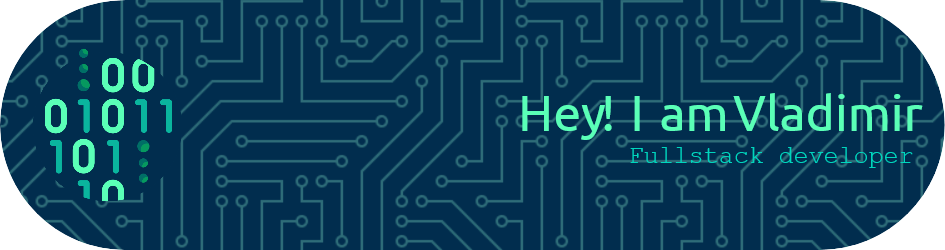

<!-- Header -->

<!-- Tecnologies -->

    <picture>
        <source media="(prefers-color-scheme: dark)" type="image/png" src="https://github.com/tandpfun/skill-icons/raw/main/icons/NodeJS-Dark.svg">
        <!-- <source media="(prefers-color-scheme: light)" srcset="https://github.com/tandpfun/skill-icons/raw/main/icons/NodeJS-Light.svg"> -->
        
    </picture>

<picture>
  <source media="(prefers-color-scheme: dark)" srcset="https://raw.githubusercontent.com/kosmo00/kosmo00/output/github-contribution-grid-snake-dark.svg">
  <source media="(prefers-color-scheme: light)" srcset="https://raw.githubusercontent.com/kosmo00/kosmo00/output/github-contribution-grid-snake.svg">
  
</picture>